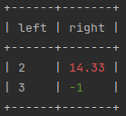

# PHP Array To Text Table

[](https://packagist.org/packages/dekor/php-array-table)
[](https://packagist.org/packages/dekor/php-array-table)
[](https://packagist.org/packages/dekor/php-array-table)
[](https://packagist.org/packages/dekor/php-array-table)
[](https://github.com/deniskoronets/php-array-table/actions/workflows/tests.yml)


PHP-class, which allows to transform php associative arrays to cool ASCII tables.

 [Ukraine ❤](https://woo.zp.ua/en/support-ukraine/)

## Installation
Simply run composer require:
<pre>composer require dekor/php-array-table</pre>

or add to composer.json:
<pre>"dekor/php-array-table": "^2.0"</pre>

## Usage

```php
use dekor\ArrayToTextTable;

$data = [
    [
        'id' => 1,
        'name' => 'Denis Koronets',
        'role' => 'php developer',
    ],
    [
        'id' => 2,
        'name' => 'Maxim Ambroskin',
        'role' => 'java developer',
    ],
    [
        'id' => 3,
        'name' => 'Andrew Sikorsky',
        'role' => 'php developer',
    ]
];

echo (new ArrayToTextTable($data))->render();
```

Will draw the next output:

<pre>
+----+-----------------+----------------+
| id | name            | role           |
+----+-----------------+----------------+
| 1  | Denis Koronets  | php developer  |
| 2  | Maxim Ambroskin | java developer |
| 3  | Andrew Sikorsky | php developer  |
+----+-----------------+----------------+
</pre>

## Formatters (since v2)

Version 2 introduces a new feature that allows to pre and postprocess column data by applying filters.

You're able to develop your own formatters by extending `BaseColumnFormatter` and implementing abstract methods.

List of formatters out of the box:
- `AlignFormatter` - allows to set text align for inner column (useful for numbers):

```php
use dekor\ArrayToTextTable;
use dekor\formatters\AlignFormatter;

$data = [
    [
        'left' => 2,
        'center' => 'Dummy one',
        'right' => 14.33,
    ],
    [
        'left' => 3,
        'center' => 'Another great day for a great inventers!',
        'right' => 1,
    ],
];

$builder = new ArrayToTextTable($data);
$builder->applyFormatter(new AlignFormatter(['center' => 'center', 'right' => 'right']));

echo $builder->render();
```

outputs:
<pre>
+------+------------------------------------------+-------+
| left | center                                   | right |
+------+------------------------------------------+-------+
| 2    |                Dummy one                 | 14.33 |
| 3    | Another great day for a great inventers! |     1 |
+------+------------------------------------------+-------+
</pre>

- `SprintfFormatter` - allows to format column value before rendering using sprintf function (ex: %01.3f)
```php
use dekor\ArrayToTextTable;
use dekor\formatters\SprintfFormatter;

$data = [
    [
        'left' => 1,
        'right' => 2.89,
    ]
];

$builder = new ArrayToTextTable($data);
$builder->applyFormatter(new SprintfFormatter(['left' => '%01.3f', 'right' => '%03.3f']));

echo $builder->render();
```

outputs:
<pre>
+-------+-------+
| left  | right |
+-------+-------+
| 1.000 | 2.890 |
+-------+-------+
</pre>

- `ColorFormatter` - allows to highlight text with specific color (only works in terminal):
```php
use dekor\ArrayToTextTable;
use dekor\formatters\ColorFormatter;

$data = [
    ['test' => 1],
    ['test' => -1],
];

$builder = new ArrayToTextTable($data);
$builder->applyFormatter(new ColorFormatter(['test' => fn ($value) => $value > 0 ? 'Red' : 'Green']));

echo $builder->render() . PHP_EOL;
```

outputs:



Allowed colors list (see `ColorFormatter::$colors`)
- Black
- Dark Grey
- Red
- Light Red
- Green
- Light Green
- Brown
- Yellow
- Blue
- Light Blue
- Magenta
- Light Magenta
- Cyan
- Light Cyan
- Light Grey
- White

### Creds:
<b>Made with ❤ by <a href="https://woo.zp.ua">Denys</b> 
(sponsored by: <a href="https://mobicard.com.ua/">mobicard</a>, <a href="https://busyb.com.ua/">busyb</a>)
